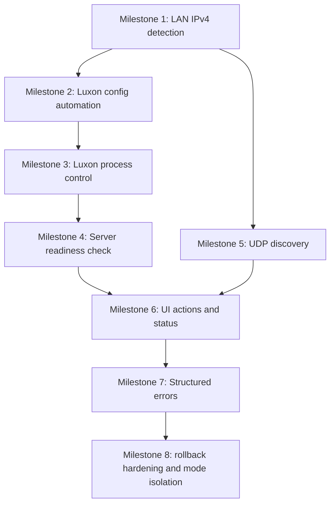

# PEAK LAN Mod: Authoritative LAN Workflow Implementation Plan

Status: Approved
Date approved: 2026-08-02
Plan version: 1.0
Authority: This file is the canonical implementation and milestone-tracking plan for the LAN workflow workstream.
Scope type: Planning only (no milestone implementation in this document)

## Validation status of this plan

- Method: static analysis only.
- Compiled in this planning task: no.
- Runtime tested in this planning task: no.
- Two-machine verified in this planning task: no.
- Physically offline LAN verified in this planning task: no.

## Verified current baseline

The following baseline is treated as verified from prior work and should be preserved while implementing milestones:

- PEAK host and client can connect through a locally running local server.
- Two machines can join the same room over LAN.
- Gameplay and Photon Voice currently work in this baseline.
- Manual configuration currently supplies local server address, room name, and server configuration.
- Release packaging process already exists.

Development modes to preserve throughout this project:

- Manual local server connection.
- Automatic local LAN host (to be implemented incrementally).
- LAN client discovery/join (to be implemented incrementally).

Out of scope to preserve:

- Custom Photon Cloud mode is intentionally not preserved going forward.

## Architectural decisions

1. Use in-plugin process control first release
- Decision: Start and stop Luxon from the BepInEx plugin, with explicit ownership tracking.
- Rationale: Lowest complexity and fastest path to value; no separate deployment artifact needed.
- Revisit trigger: move to helper executable only if privileges, crash-supervision, or process arbitration require it.

2. Keep manual mode as rollback and safety baseline
- Decision: Every new behavior is guarded by configuration and mode selection.
- Rationale: Enables immediate fallback if any automatic flow regresses.

3. Introduce a LAN coordination layer, not UI-driven networking
- Decision: UI publishes intents and renders state only. Networking/process/discovery logic lives in services.
- Rationale: Keeps flow testable and avoids scene/UI coupling.

4. Introduce structured connection and error states
- Decision: Use explicit connection phases and typed error codes.
- Rationale: Enables deterministic UI messaging and troubleshooting.

5. UDP broadcast discovery with versioned schema
- Decision: Use a compact, versioned discovery message for host advertisements and client session listing.
- Rationale: LAN-friendly, no central server dependency, easy to diagnose.

6. Keep diagnostics focused and non-sensitive
- Decision: Continue callback and state probes where needed, sanitize identifiers, avoid secrets.
- Rationale: Supports evidence-first debugging while respecting repository safety rules.

## Existing relevant classes and patch points

Current files involved in LAN/network behavior and diagnostics:

- `src/PeakLanMod/Plugin.cs`
- `src/PeakLanMod/PhotonCallbackProbe.cs`
- `src/PeakLanMod/Patches/PhotonAppIdPatch.cs`
- `src/PeakLanMod/Patches/NetworkConnectorStartPatch.cs`
- `src/PeakLanMod/Patches/NetworkConnectorPatches.cs`
- `src/PeakLanMod/Patches/PhotonCallTracePatches.cs`
- `src/PeakLanMod/Patches/PhotonExitTracePatches.cs`
- `src/PeakLanMod/Patches/OfflineModeTracePatch.cs`
- `src/PeakLanMod/Patches/GenerateRoomNamePatch.cs`
- `src/PeakLanMod/Patches/CloseConnectionProbe.cs`

## Proposed interfaces and responsibilities

### Coordination and mode

- `ILanModeCoordinator`
  - Orchestrates host/join workflows by mode.
  - Applies sequencing: detect -> configure -> start -> probe -> connect -> room operations.

- `ILanConnectionStateStore`
  - Canonical in-memory state for connection phase, errors, discovery, and status text.

### OS/process/config concerns

- `ILanEndpointResolver`
  - Detects suitable LAN IPv4 endpoint for host advertisement and Luxon config.

- `ILuxonConfigManager`
  - Reads/writes runtime Luxon config and updates all advertised `external_address` entries.

- `ILuxonProcessController`
  - Controlled process startup and shutdown with owned/unowned process semantics.

- `ILuxonReadinessProbe`
  - Probes NameServer readiness before PEAK attempts Photon connect.

### Discovery

- `ILanDiscoveryBroadcaster`
  - Host-side UDP broadcast sender of session announcements.

- `ILanDiscoveryListener`
  - Client-side UDP listener with dedupe and TTL eviction.

### UI bridge

- `ILanStatusPresenterBridge`
  - Writes user-facing status and errors into UI sinks.
  - Contains no networking/process logic.

- `ILanActionsController`
  - Handles UI intents:
    - Host LAN Game
    - Join LAN Game
    - Select discovered session
    - Retry/refresh actions

### Diagnostics/error mapping

- `ILanErrorClassifier`
  - Maps Photon callbacks/causes/return codes and phase context into structured LAN error codes.

## Proposed new files

Planned file additions (planning target paths):

- `src/PeakLanMod/Lan/Model/LanMode.cs`
- `src/PeakLanMod/Lan/Model/LanConnectionPhase.cs`
- `src/PeakLanMod/Lan/Model/LanErrorCode.cs`
- `src/PeakLanMod/Lan/Model/LanErrorDetail.cs`
- `src/PeakLanMod/Lan/Model/LanSessionInfo.cs`
- `src/PeakLanMod/Lan/State/LanConnectionStateStore.cs`
- `src/PeakLanMod/Lan/Services/LanModeCoordinator.cs`
- `src/PeakLanMod/Lan/Services/LanEndpointResolver.cs`
- `src/PeakLanMod/Lan/Services/LuxonConfigManager.cs`
- `src/PeakLanMod/Lan/Services/LuxonProcessController.cs`
- `src/PeakLanMod/Lan/Services/LuxonReadinessProbe.cs`
- `src/PeakLanMod/Lan/Discovery/UdpLanDiscoveryBroadcaster.cs`
- `src/PeakLanMod/Lan/Discovery/UdpLanDiscoveryListener.cs`
- `src/PeakLanMod/Lan/UI/LanStatusPresenterBridge.cs`
- `src/PeakLanMod/Lan/UI/LanActionsController.cs`
- `src/PeakLanMod/Lan/UI/LanDiscoveredSessionsViewModel.cs`
- `src/PeakLanMod/Lan/Diagnostics/LanErrorClassifier.cs`
- `src/PeakLanMod/Lan/Diagnostics/LanEventLog.cs`

## Planned class renames for patch files

Class renames are approved as part of future implementation, when behavior expands beyond current scope:

- `PhotonAppIdPatch` -> `ConnectToNetworkSettingsPatch`
- `NetworkConnectorPatches` -> `NetworkConnectorLifecycleTracePatch`
- `NetworkConnectorStartPatch` -> `NetworkConnectorStateTracePatch`
- `PhotonCallTracePatches` -> `PhotonApiCallTracePatch`
- `PhotonExitTracePatches` -> `PhotonExitPathTracePatch`
- `OfflineModeTracePatch` -> `PhotonOfflineModeSetterTracePatch`
- `CloseConnectionProbe` -> `PhotonCloseConnectionTracePatch`

Rename rule: rename only when file responsibilities have actually changed, not just for cosmetic consistency.

## Configuration model changes

Planned config additions:

- `LanWorkflow.Mode`:
  - `ManualLocalServer`
  - `AutoLocalLanHost`
  - `LanClientDiscoveryJoin`
- `LanWorkflow.AutoStartLuxonOnHost` (bool)
- `LanWorkflow.AutoStopOwnedLuxonOnExit` (bool)
- `LanWorkflow.ReadinessTimeoutMs` (int)
- `LanWorkflow.ReadinessPollIntervalMs` (int)
- `LanWorkflow.DiscoveryEnabled` (bool)
- `LanWorkflow.DiscoveryUdpPort` (int)
- `LanWorkflow.DiscoveryBroadcastIntervalMs` (int)
- `LanWorkflow.DiscoveryEntryTtlMs` (int)
- `LanWorkflow.PreferredHostIPv4` (string, optional)
- `LanWorkflow.AllowedHostInterfaces` (string, optional CSV)
- `LanWorkflow.ProtocolVersion` (int or semver-compatible string)
- `LanWorkflow.RequireVersionMatch` (bool)

Retained compatibility requirement:

- Existing manual room name/address settings remain usable in `ManualLocalServer` mode.

## Process ownership and shutdown rules

Ownership states:

- `NotStartedByPlugin`
- `StartedByPlugin`
- `StoppedByPlugin`

Rules:

- If plugin starts Luxon, process is owned and may be stopped by plugin according to config.
- If Luxon was already running before plugin starts host flow, process is unowned and must not be stopped by plugin.
- On plugin unload/game exit:
  - owned process: graceful stop, then force kill after timeout if configured.
  - unowned process: never stop.
- On host cancel/reset:
  - stop only if owned and setting permits.

## UDP discovery message schema (v1)

Message type: JSON UTF-8 over UDP broadcast.

Required fields:

- `type`: `peak_lan_announce`
- `schema_version`: `1`
- `protocol_version`: integer/string
- `game_version`: string
- `mod_version`: string
- `room_name`: string
- `host_display_name`: string
- `nameserver_address`: string
- `nameserver_port`: integer
- `transport`: `Udp` or `Tcp`
- `scene`: string
- `server_instance_id`: string
- `sent_at_utc`: ISO-8601 string

Client-side behavior:

- Deduplicate by `server_instance_id + room_name`.
- Expire sessions not refreshed before TTL.
- Reject incompatible versions and surface explicit reason.

## Version compatibility rules

Host/client session compatibility checks:

1. Protocol version must match exactly.
2. Game version policy:
- first release default: exact match.
3. Mod version policy:
- first release default: exact match.

Structured incompatibility errors:

- `IncompatibleProtocolVersion`
- `IncompatibleGameVersion`
- `IncompatibleModVersion`

## Connection and error state models

Connection phases:

- `Idle`
- `DetectingHostAddress`
- `WritingLuxonConfig`
- `StartingLuxon`
- `WaitingForLuxonReady`
- `ConnectingNameServer`
- `ConnectedToNameServer`
- `RedirectingToMaster`
- `ConnectedToMaster`
- `RedirectingToGameServer`
- `JoiningRoom`
- `JoinedRoom`
- `Failed`
- `ShuttingDownLuxon`

Structured errors:

- `LuxonNotRunning`
- `NameServerUnreachable`
- `MasterServerRedirectFailed`
- `GameServerRedirectFailed`
- `RoomDoesNotExist`
- `IncompatibleGameVersion`
- `IncompatibleModVersion`
- `IncompatibleProtocolVersion`
- `Timeout`
- `UnknownPhotonFailure`

## UI consumption model (no networking logic in UI)

UI responsibilities:

- Publish intent commands only.
- Render state snapshots only.
- Display discovered sessions list and status labels.
- Display structured error with retry hints.

UI must not:

- Call Photon APIs directly.
- Manage process lifecycle.
- Parse/configure Luxon.
- Open UDP sockets.

## Milestone dependency graph

## Milestone tracking table

Status enum:

- `Planned`
- `InProgress`
- `Blocked`
- `Done`
- `VerifiedTwoMachine`
- `VerifiedOffline`

| Milestone | Title | Depends On | Status | Acceptance Status | Rollback Path Verified | Owner | Target PR | Last Updated |
|---|---|---|---|---|---|---|---|---|
| M1 | Automatic LAN IPv4 detection on host | None | Done | Static complete; runtime pending | Yes (config rollback) | TBD | PR-01 | 2026-08-02 |
| M2 | Automatic Luxon config including all external_address values | M1 | Done | Static complete; runtime pending | Yes (config rollback) | TBD | PR-02 | 2026-08-02 |
| M3 | Controlled Luxon startup/shutdown | M2 | VerifiedTwoMachine | Manual two-machine validation passed; PR-03 merged and accepted; offline validation pending | Yes (config rollback) | TBD | PR-03 | 2026-08-02 |
| M4 | Server-readiness check before PEAK connects | M3 | VerifiedOffline | Physically offline two-machine runtime validation passed (host and client on separate machines/accounts); rollback path retained | Yes (config rollback) | TBD | PR-04 | 2026-08-02 |
| M5 | UDP LAN session discovery | M1 | Done | Static complete; runtime pending | Yes (config rollback) | TBD | PR-05 | 2026-08-02 |
| M6 | UI actions for host/join/sessions/status | M4, M5 | Done | Static complete; runtime pending | Yes (config rollback) | TBD | PR-06 | 2026-08-02 |
| M7 | Structured connection errors and mapping | M6 | Planned | Not started | Not started | TBD | PR-07 | 2026-08-02 |
| M8 | Final mode isolation and rollback hardening | M7 | Planned | Not started | Not started | TBD | PR-08 | 2026-08-02 |

## Acceptance criteria per milestone

### M1: Automatic LAN IPv4 detection on host

- Host can select a valid non-loopback IPv4 endpoint automatically.
- Selected endpoint is logged safely for diagnostics.
- Manual override remains possible.
- Works with multiple adapters (priority and filtering rules documented).

M1 implementation notes (2026-08-02):

- Added `LanEndpointResolver` with host selection rules: preferred IPv4 override first, then non-loopback IPv4 auto-detection on active interfaces.
- Added optional adapter filtering via CSV (`AllowedHostInterfaces`) using interface name/description/id contains matching.
- Added host-only config guard (`AutoDetectHostIPv4`) so manual mode remains unchanged by default.
- Added masked/sanitized endpoint diagnostics and endpoint fingerprint logging.
- Rollback path confirmed in config: disable `AutoDetectHostIPv4` and continue with manual `Photon.LocalServerAddress`.

### M2: Automatic Luxon configuration

- Runtime config generation updates all relevant `external_address` values:
  - NameServer
  - MasterServer
  - GameServer
- Generated config is deterministic and repeatable from same inputs.
- Manual mode config behavior remains unchanged.

M2 implementation notes (2026-08-02):

- Added `LuxonConfigManager` to rewrite host portions of `external_address` values under `NameServer`, `MasterServer`, and `GameServer` while preserving existing ports.
- Added host-only config guard `LanWorkflow.AutoUpdateLuxonConfigOnHost` (default `false`) and path setting `LanWorkflow.LuxonConfigPath`.
- Wired automation into direct host flow after host endpoint selection and before connect sequence.
- Added focused diagnostics for success/failure with sanitized host endpoint logging and update counts.
- Rollback path confirmed in config: disable `AutoUpdateLuxonConfigOnHost` and keep manual Luxon config management.

### M3: Controlled Luxon startup/shutdown

- Host mode can start Luxon when not running.
- Process ownership tracked correctly.
- Plugin stops only owned process when configured.
- Plugin never stops externally-managed Luxon.

M3 implementation notes (2026-08-02):

- Added `LuxonProcessController` with explicit ownership states: `NotStartedByPlugin`, `StartedByPlugin`, `StoppedByPlugin`.
- Added host-only process guard `LanWorkflow.AutoStartLocalServerOnHost` (default `false`) to preserve manual startup baseline.
- Added process launch settings: `LanWorkflow.LocalServerExecutablePath`, `LanWorkflow.LocalServerWorkingDirectory`, `LanWorkflow.LocalServerStartArguments`.
- Added stop-on-exit controls for plugin-owned process only: `LanWorkflow.AutoStopOwnedLocalServerOnExit`, `LanWorkflow.ForceKillOwnedLocalServerOnExit`, `LanWorkflow.OwnedLocalServerStopTimeoutMs`.
- Wired process check/start into direct host sequence after M1/M2 host-prep steps and before connect sequence.
- Added ownership-focused diagnostics (started-by-plugin vs already-running external process, with process ID and sanitized executable path fingerprinting).
- Rollback path confirmed in config: disable `AutoStartLocalServerOnHost` and keep fully manual local server lifecycle.

M3 validation update (2026-08-02):

- Validation type: manual two-machine runtime.
- Outcome: passed.
- Release status: PR-03 merged and accepted.
- Remaining validation: physically offline LAN verification still pending.

### M4: Readiness check before PEAK connect

- Host/join flow waits for NameServer readiness before connecting.
- Timeout results in explicit structured error.
- Retry path exists and does not require restart.

M4 implementation notes (2026-08-02):

- Added `LuxonReadinessProbe` with protocol-aware NameServer probes and bounded wait loop (`TryProbeNameServer`, `TryWaitForNameServerReady`).
- Added config guard `LanWorkflow.EnableLocalServerReadinessCheck` (default `false`) so pre-M4 behavior remains available by default.
- Added readiness timing config: `LanWorkflow.ReadinessTimeoutMs` and `LanWorkflow.ReadinessPollIntervalMs`.
- Wired readiness gating into both direct host and direct join flows before Photon connect attempts.
- Integrated queued-host compatibility with `AutoRetryDirectHostUntilReady`: host intent remains queued until readiness succeeds or timeout is reached.
- Added focused diagnostics for readiness success/failure with sanitized endpoint, protocol, elapsed milliseconds, attempt count, and last probe failure reason.
- Rollback path confirmed in config: disable `EnableLocalServerReadinessCheck` to return to pre-M4 connect behavior.

M4 validation update (2026-08-02):

- Validation type: physically offline LAN, two-machine runtime.
- Environment: host and client on separate machines using separate Steam accounts.
- Network condition: internet path removed; local LAN path only.
- Outcome: passed.
- Remaining scope outside M4: M5+ milestones unchanged.

### M5: UDP LAN session discovery

- Host broadcasts discoverable session announcements.
- Client receives, deduplicates, and expires stale entries by TTL.
- Incompatible sessions are visible with explicit reason.

M5 implementation notes (2026-08-02):

- Added `UdpLanDiscoveryBroadcaster` for host-side UDP broadcast announcements using schema `type=peak_lan_announce` and `schema_version=1`.
- Added `UdpLanDiscoveryListener` with required-field validation, malformed packet rejection diagnostics, dedupe key `server_instance_id + room_name`, and TTL-based eviction.
- Added `LanConnectionStateStore` and `LanSessionInfo` to maintain in-memory discovered-session snapshots for future UI integration (M6).
- Added config guards and settings:
  - `LanWorkflow.DiscoveryEnabled`
  - `LanWorkflow.DiscoveryUdpPort`
  - `LanWorkflow.DiscoveryBroadcastIntervalMs`
  - `LanWorkflow.DiscoveryEntryTtlMs`
  - `LanWorkflow.ProtocolVersion`
  - `LanWorkflow.RequireVersionMatch`
- Added compatibility classification for discovered sessions with explicit reasons:
  - `IncompatibleProtocolVersion`
  - `IncompatibleGameVersion`
  - `IncompatibleModVersion`
- Wired host announcement lifecycle to Photon callbacks (`OnCreatedRoom`, `OnJoinedRoom`, `OnDisconnected`) while preserving existing host/join connection flow.
- Rollback path confirmed in config: set `LanWorkflow.DiscoveryEnabled = false` to disable M5 behavior and return to pre-M5 networking behavior.

M5 validation update (2026-08-02):

- Validation type: static analysis and local compile.
- Runtime outcome: pending manual two-machine verification.
- Remaining scope outside M5: M6+ milestones unchanged.

### M6: UI actions and connection status

- UI supports:
  - Host LAN Game
  - Join LAN Game
  - discovered sessions
  - connection status
- UI displays live phase updates from state store.
- UI invokes coordinator intents only.

M6 implementation notes (2026-08-02):

- Added `Lan/UI/LanDiscoveredSessionsViewModel` for discovered-session snapshot and selection state.
- Added `Lan/UI/LanStatusPresenterBridge` for rendering connection/session state snapshots into overlay text.
- Extended `LanConnectionStateStore` with connection-phase snapshots (`SetConnectionPhase`, `GetConnectionPhaseSnapshot`) used by the M6 status UI.
- Wired M6 behavior behind config guard `LanWorkflow.EnableLanUiActions` (default `false`) to preserve pre-M6 host/join and overlay behavior by default.
- Added M6 UI panel settings:
  - `LanWorkflow.EnableLanUiActions`
- Updated first-release M6 controls to clickable overlay buttons (`Host LAN`, `Join Selected`, `Refresh`) and clickable session rows.
- Updated M6 list rendering to a scrollable session view with no fixed item-count cap.
- Updated M6 panel visibility so server list renders only when main menu scene is loaded.
- Added M6 UX Part 2 usability behaviors:
  - `Join Selected` is disabled until a compatible session is selected.
  - Inline panel message explains why join is unavailable.
  - Panel shows `Last refresh` timestamp with lightweight periodic auto-refresh plus manual refresh.
- Join-selected flow applies discovered session room/endpoints/protocol then reuses the existing direct join path.
- Added focused diagnostics for selection changes, join-selected incompatibility blocks, unsupported transport, and applied join-selected endpoint settings.
- Rollback path confirmed in config: set `LanWorkflow.EnableLanUiActions = false`.

M6 validation update (2026-08-02):

- Validation type: static analysis and local compile.
- Runtime outcome: pending manual two-machine verification.
- Remaining scope outside M6: M7+ milestones unchanged.

### M7: Structured error mapping

- Distinguish and display these error categories:
  - Luxon is not running
  - NameServer is unreachable
  - MasterServer redirect failed
  - GameServer redirect failed
  - room does not exist
  - incompatible game/mod/protocol versions
- Mapping is deterministic and logged with context.

### M8: Rollback hardening and mode isolation

- Manual local server mode remains functional and unaffected.
- Auto local host mode functions with process/readiness workflow.
- LAN discovery/join mode functions end to end.
- Mode switching does not leak process/discovery state.

## Unresolved questions

- Which PEAK UI surface should become primary for discovered sessions list in the first release?
- Should discovery announcements include optional host capacity and current player count now or later?
- Should protocol compatibility permit patch-level mod version drift at launch, or exact-only?
- Is Photon Voice always required for acceptance in LAN mode, or can voice be a separate readiness gate?
- Which adapter precedence rule is preferred when both Ethernet and Wi-Fi are active?

## Decision log

| Date | Decision | Outcome | Notes |
|---|---|---|---|
| 2026-08-02 | Use in-plugin Luxon process control for first release | Accepted | Helper executable deferred pending concrete need. |
| 2026-08-02 | Preserve manual mode as hard rollback path | Accepted | Required through all milestones. |
| 2026-08-02 | Remove Custom Photon Cloud preservation requirement | Accepted | LAN-only direction approved by user. |
| 2026-08-02 | Use typed connection phases and structured LAN errors | Accepted | Enables deterministic UI and diagnostics. |
| 2026-08-02 | Use UDP broadcast with versioned schema for discovery | Accepted | No central service required. |
| 2026-08-02 | Allow class renaming for patch classes as responsibilities evolve | Accepted | Rename only when function changes justify it. |
| 2026-08-02 | M1 host endpoint selection policy: `PreferredHostIPv4` override, otherwise active non-loopback IPv4 with optional interface filters | Accepted | Implemented with config guard and sanitized diagnostics; manual LocalServerAddress remains rollback path. |
| 2026-08-02 | M2 Luxon config automation rewrites `external_address` host values while preserving ports | Accepted | Implemented as host-only, config-gated behavior with deterministic file updates and manual rollback path. |
| 2026-08-02 | Local server mode is the only supported runtime baseline | Accepted | No Photon Cloud connection path is required for this mod going forward. |
| 2026-08-02 | Replace Luxon/Photon-specific mode naming with generic LocalServer naming in planning artifacts | Accepted | Apply as incremental renames in implementation milestones where behavior ownership changes. |
| 2026-08-02 | M3 ownership detection uses executable-path match before launch and treats pre-existing process as unowned | Accepted | Prevents plugin from taking ownership of externally managed local server process. |
| 2026-08-02 | M3 manual two-machine validation passed and PR-03 is merged/accepted | Accepted | M4 may proceed; offline verification remains a separate gate. |
| 2026-08-02 | M4 readiness gate uses protocol-aware endpoint probes with queue-safe host retry handling and bounded timeout | Accepted | Implemented as config-gated (`EnableLocalServerReadinessCheck`) to preserve rollback and existing baseline behavior. |
| 2026-08-02 | M4 physically offline two-machine validation passed | Accepted | Host and client succeeded on separate machines/accounts with internet path removed; milestone status advanced to `VerifiedOffline`. |
| 2026-08-02 | M5 discovery transport uses UDP broadcast + TTL session store with compatibility tagging | Accepted | Implemented with config gating and callback-driven host broadcast lifecycle; UI consumption deferred to M6. |
| 2026-08-02 | M6 first-release UI surface uses config-gated overlay + action keys wired to existing host/join flows | Accepted | Minimizes risk to proven networking path while exposing session selection/status without introducing new Photon call sites in UI helpers. |
| 2026-08-02 | M6 interaction model uses clickable overlay controls instead of M6-specific shortcuts | Accepted | Improves discoverability and avoids hidden keybind UX on first release while preserving existing F6/F7 baseline controls. |
| 2026-08-02 | M6 UX Part 2 requires disabled join affordance and inline reason before join-selected | Accepted | Prevents no-op clicks and makes incompatibility/selection state obvious without changing host/join network orchestration. |

## Deviation record

- 2026-08-02: No deviation from M2 scope. Implemented host-side Luxon config automation only; M3+ behavior remains unchanged.
- 2026-08-02: Prior temporary diagnostic fallback note about preserving CustomCloud is superseded by the approved LAN-only baseline decision.
- 2026-08-02: M3 manual two-machine validation passed and PR-03 merged/accepted; physically offline validation remains pending.
- 2026-08-02: No deviation from M4 scope. Implemented readiness gating only; M5+ discovery/UI/error-mapping milestones remain unchanged.
- 2026-08-02: No deviation from M4 validation scope. Validation executed as physically offline LAN two-machine runtime with separate accounts.
- 2026-08-02: No deviation from M5 scope. Implemented transport/listener/session-store only; no UI wiring added before M6.
- 2026-08-02: Minor M6 architectural deviation from long-term plan shape: connection intent execution remains in `Plugin` with `LanStatusPresenterBridge`/view-model presentation helpers. Dedicated coordinator extraction remains deferred to a later refactor milestone.

## Recommended small PR sequence

- PR-01: M1 foundation and LAN mode/state model bootstrap.
- PR-02: M2 Luxon config automation.
- PR-03: M3 process control ownership lifecycle.
- PR-04: M4 readiness probe and gating.
- PR-05: M5 UDP discovery transport and session store integration.
- PR-06: M6 UI intent and session/status rendering integration.
- PR-07: M7 structured error classifier and user-facing mapping.
- PR-08: M8 rollback hardening, mode isolation, and cleanup.

## Change-control notes for this plan file

- Update this file whenever milestone status changes.
- Add new decisions to Decision log; do not overwrite prior decisions.
- Record unresolved questions until explicitly resolved.
- If dependencies change, update graph and milestone table in the same commit.
